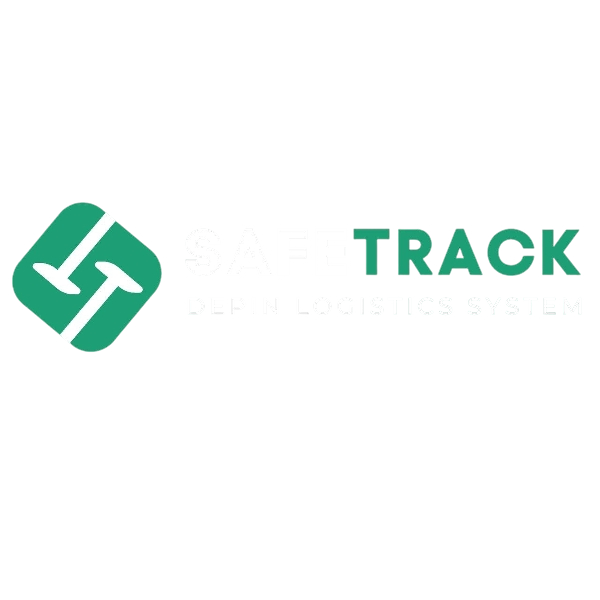

<p align="center">
  
</p>

<h1 align="center">SafeTrack DePIN</h1>

<p align="center">
  <em>Shipment clarity, without the noise — sensors, risk scores, and blockchain proofs in one calm view.</em>
</p>

<p align="center">
  
  
  
  
  
  
</p>

---

## What is SafeTrack DePIN?

**SafeTrack** is a Decentralized Physical Infrastructure Network (DePIN) logistics platform that turns ESP32-powered smart sensor boxes into tamper-evident, AI-scored shipment monitors.

Every time a package moves, its ESP32 node reads **shock (G-force), vibration frequency, temperature, and humidity** in real time. That telemetry is scored by an on-device **ONNX inference model** (sub-millisecond latency), producing a `SAFE / WARNING / DANGER` risk label. The verdict — along with a cryptographic hash — is anchored permanently to the **0G decentralized storage network**, creating an immutable chain of evidence that any party can audit.

When thresholds are breached, **smart contracts on the 0G Galileo Testnet automatically lock or release USDC escrow**, resolving disputes without manual intervention. The entire flow — from hardware ping to blockchain proof — is exposed through a polished Next.js dashboard that operators and logistics partners can use out of the box.

### The problem it solves

> Traditional logistics relies on a "he said / she said" model when cargo arrives damaged. There is no trustworthy, real-time record of what happened in transit. SafeTrack replaces that ambiguity with cryptographic, on-chain proof — eliminating disputes before they start.

---

## Features

- 🛰️ **Real-time ESP32 telemetry** — shock (ax/ay/az), resultant G-force, delta-g, shock frequency (Hz), temperature, and humidity streamed continuously via MQTT/HTTPS
- 🤖 **On-device ONNX AI inference** (Mirofish Engine) — risk scoring in < 1 ms; classifies every event as `SAFE`, `WARNING`, or `DANGER` with per-class probabilities and a plain-English action recommendation
- 📡 **G-Force threshold alerting** — four configurable tiers (0–3g normal · 3–5g inspect · 5–8g incident report · >8g critical escalation) with automated incident creation
- 🔗 **0G Network immutable proofs** — every sensor event is hashed and stored as a CID on the 0G decentralized storage layer; hashes are auditable on-chain via the 0G Explorer
- 🗺️ **Interactive MapLibre shipment map** — live coordinates per box, clickable markers, and full telemetry detail panels (G-force peak, AI risk %, battery, signal strength)
- 💰 **Smart contract escrow (Claims & Settlements)** — USDC locked at shipment start, auto-released on delivery or auto-triggered for damage claims; TVL, dispute count, and refund history tracked in-dashboard
- 📦 **Device lifecycle management** — B2B and B2C hardware pool tracking (In-Transit / Delivered / Return Pending / Maintenance) with QR handover scanning
- 🔮 **Predictive AI analytics** — route optimisation suggestions, battery degradation forecasts, seasonal impact pattern detection, and packaging recommendations (confidence-scored)
- 🏷️ **Dual pricing model** — Consumer deposit-and-return (device ships inside the package, refunded via smart contract) and B2B logistics-partner integration (fleet management, white-label dashboard, REST API + webhooks)
- 🌐 **Web3 wallet connect** — RainbowKit + Wagmi on the 0G Galileo Testnet (chain ID 16602); wallet required for escrow actions
- 🎨 **Animated 3D hero** — React Three Fiber / Three.js interactive scene on the landing page; GSAP scroll-triggered animations throughout
- ⚙️ **Operator settings** — manage 0G Network API keys, Mirofish AI Engine keys, and Sensor Gateway keys in-dashboard; toggle alerts, set retention and auto-sync intervals

---

## Tech Stack

| Layer                     | Technology                                                                      |
| ------------------------- | ------------------------------------------------------------------------------- |
| **Frontend Framework**    | [Next.js 16](https://nextjs.org/) (Pages Router, React Compiler, Strict Mode)   |
| **UI Language**           | TypeScript 5, React 19                                                          |
| **Styling**               | Tailwind CSS v4, shadcn/ui (Radix UI primitives)                                |
| **Animations**            | GSAP 3 (ScrollTrigger), React Three Fiber + Three.js (3D hero)                  |
| **Charts**                | Recharts                                                                        |
| **Maps**                  | MapLibre GL                                                                     |
| **Blockchain / DePIN**    | [0G Network Testnet Galileo](https://0g.ai/) (chain ID 16602, native token: 0G) |
| **Web3 Wallet**           | RainbowKit + Wagmi v2 + Viem                                                    |
| **IoT Hardware**          | ESP32 microcontroller (shock, G-force, temperature, humidity sensors)           |
| **AI / Inference**        | ONNX Runtime (on-device, model: Mirofish Engine)                                |
| **Decentralized Storage** | 0G Storage (CID-addressed, blockchain-verified)                                 |
| **Icons**                 | Lucide React                                                                    |
| **MCP Integration**       | shadcn MCP server                                                               |

---

## Architecture Overview

SafeTrack follows a unidirectional pipeline from physical hardware to on-chain proof:

```
┌─────────────────────────────────────────────────────────────────┐
│                     SafeTrack DePIN Pipeline                    │
└─────────────────────────────────────────────────────────────────┘

  [01] ESP32 + Sensors          [02] Gateway
   ax/ay/az · shock Hz   ──►   MQTT / HTTPS batches
   temperature · humidity        outbound to API

                                      │
                                      ▼

  [03] API Route                [04] ONNX Inference
   Validate & forward    ──►   Score · Label · Model hash
   to inference                 (Mirofish Engine, < 1ms)

                                      │
                                      ▼

  [05] 0G Storage               [06] Escrow Contract
   CID-backed evidence   ──►   Threshold-driven settlement
   immutable record             (USDC lock / release)

                                      │
                                      ▼

  [07] Dashboard                [08] Users / Operators
   Timeline · Proofs    ◄───   Scan QR · Submit claim
   AI predictions               Confirm delivery
```

**Key architectural decisions:**

- The ONNX model runs **on the ESP32 edge device** — not in the cloud — so risk scoring survives connectivity loss and adds zero cloud inference latency.
- Evidence is **pushed to 0G** before the dashboard shows it, ensuring the audit trail always leads the UI.
- Smart contracts hold funds in **escrow from the start** of a shipment, so payouts are mathematically guaranteed on valid claims regardless of courier cooperation.

---

## Getting Started

### Prerequisites

| Requirement                    | Version                        |
| ------------------------------ | ------------------------------ |
| Node.js                        | ≥ 20                           |
| npm                            | ≥ 10                           |
| Git                            | any recent                     |
| A Web3 wallet (MetaMask, etc.) | for escrow features            |
| 0G Galileo Testnet RPC access  | `https://evmrpc-testnet.0g.ai` |

### Installation

```bash
# 1. Clone the repository
git clone https://github.com/Rizxh/safetrack-depin.git
cd safetrack-depin

# 2. Install dependencies
npm install

# 3. Copy the environment template and fill in your keys
cp .env.example .env.local
```

### Environment Variables

Create a `.env.local` file at the project root with the following variables:

```env
# 0G Network integration
NEXT_PUBLIC_0G_API_KEY=your_0g_api_key_here

# Mirofish AI Engine
NEXT_PUBLIC_MIROFISH_API_KEY=your_mirofish_api_key_here

# Sensor Gateway
NEXT_PUBLIC_SENSOR_GATEWAY_KEY=your_sensor_gateway_key_here

# WalletConnect Project ID (from https://cloud.walletconnect.com)
NEXT_PUBLIC_WALLETCONNECT_PROJECT_ID=your_walletconnect_project_id_here
```

> **Note:** The app ships with safe fallback values for demo purposes. All API keys can be managed in the **Settings & Integrations** panel of the admin dashboard at runtime.

### Run the Development Server

```bash
npm run dev
```

Open [http://localhost:3000](http://localhost:3000) to see the landing page.
Navigate to [http://localhost:3000/admin](http://localhost:3000/admin) to open the operator dashboard.

### Production Build

```bash
npm run build
npm run start
```

---

## Project Structure

```
safetrack-depin/
├── images/
│   └── logo.png                    # Project logo
├── public/                         # Static assets
├── src/
│   ├── components/
│   │   ├── admin/
│   │   │   ├── views/
│   │   │   │   ├── OverviewSection.tsx       # Dashboard home — metrics, G-force chart, table
│   │   │   │   ├── ShipmentsSection.tsx      # MapLibre map + shipment detail panels
│   │   │   │   ├── SensorsSection.tsx        # Sensor node health overview
│   │   │   │   ├── LifecycleSection.tsx      # B2B/B2C device pool & QR handover
│   │   │   │   ├── ThresholdsSection.tsx     # G-force alert tier config
│   │   │   │   ├── IntegritySection.tsx      # 0G data hashes — copy & audit
│   │   │   │   ├── IncidentsSection.tsx      # Triggered incident reports
│   │   │   │   ├── PredictionsSection.tsx    # Mirofish AI predictive analytics
│   │   │   │   ├── ClaimSection.tsx          # Escrow claims & USDC settlements
│   │   │   │   ├── MapLibreMap.tsx           # Interactive shipment map component
│   │   │   │   └── SettingsSection.tsx       # API keys & general settings
│   │   │   ├── Dashboard.tsx                 # Main admin shell (sidebar + routing)
│   │   │   ├── GForceChart.tsx               # Recharts G-force time-series
│   │   │   ├── MetricCard.tsx                # Reusable KPI card
│   │   │   └── ShipmentTable.tsx             # Sortable shipment table
│   │   ├── layout/
│   │   │   ├── Navbar.tsx                    # Landing page navigation
│   │   │   ├── Footer.tsx                    # Landing page footer
│   │   │   ├── ScrollReveal.tsx              # GSAP scroll animation wrapper
│   │   │   └── LandingSectionHeader.tsx      # Reusable section heading
│   │   ├── sections/                         # Landing page sections
│   │   │   ├── HeroSection.tsx               # Hero + 3D scene integration
│   │   │   ├── LiveSensorCard.tsx            # "About" section with live data cards
│   │   │   ├── HowItWorks.tsx                # 3-step explainer
│   │   │   ├── Features.tsx                  # Feature list
│   │   │   ├── ProjectFlowSection.tsx        # 8-step pipeline flowchart
│   │   │   ├── FaqSection.tsx                # FAQ accordion
│   │   │   ├── ContactSection.tsx            # Contact / CTA
│   │   │   └── DocsSection.tsx               # Documentation links
│   │   ├── three/
│   │   │   └── ThreeScene.tsx                # React Three Fiber 3D hero scene
│   │   └── ui/                               # shadcn/ui primitives
│   ├── config/
│   │   ├── brand.ts                          # Display names & short names
│   │   └── wagmi.ts                          # 0G Galileo Testnet chain + RainbowKit config
│   ├── data/
│   │   ├── mockData.ts                       # Shipment records & G-force chart data
│   │   └── shipmentCoordinates.ts            # Lat/lng per box ID
│   ├── hooks/
│   │   ├── use-mobile.ts                     # Responsive breakpoint hook
│   │   └── useGSAPScrollTrigger.ts           # GSAP ScrollTrigger hook
│   ├── providers/
│   │   └── WagmiProvider.tsx                 # Wagmi + RainbowKit context
│   ├── styles/                               # Global CSS & design tokens
│   ├── types/
│   │   └── sensor.ts                         # SensorReading & PredictionResult types
│   └── pages/
│       ├── _app.tsx                          # App shell + providers
│       ├── _document.tsx                     # Custom HTML document
│       ├── index.tsx                         # Landing page
│       └── admin/
│           └── index.tsx                     # Admin dashboard entry point
├── next.config.ts                            # Next.js config (React Compiler + Strict Mode)
├── tailwind.config.ts                        # Tailwind v4 config
├── package.json
└── tsconfig.json
```

---

## Contributing

Contributions are welcome! Whether you're fixing a bug, improving docs, or proposing a new feature — open an issue first to discuss what you'd like to change.

```bash
# Fork the repo, then:
git checkout -b feature/your-feature-name
git commit -m "feat: describe your change"
git push origin feature/your-feature-name
# Open a Pull Request
```

Please keep PRs focused and include a clear description of the problem and solution. For hardware-side (ESP32/ONNX) contributions, document your sensor schema changes in `src/types/sensor.ts`.

---

## License

This project is licensed under the **MIT License** — see the [LICENSE](./LICENSE) file for details.

---

<p align="center">
  Built with ☕ and conviction that freight should arrive the way it left.
</p>
